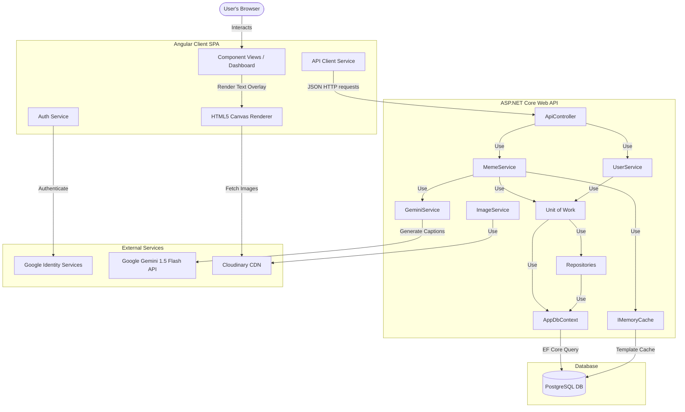
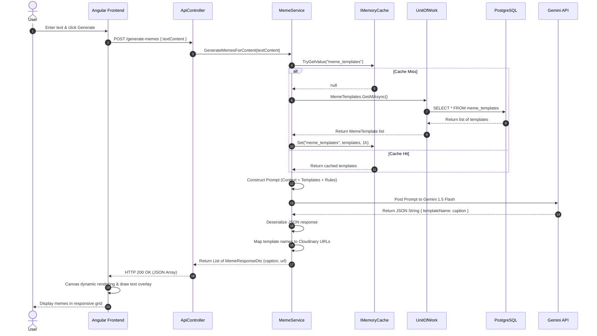
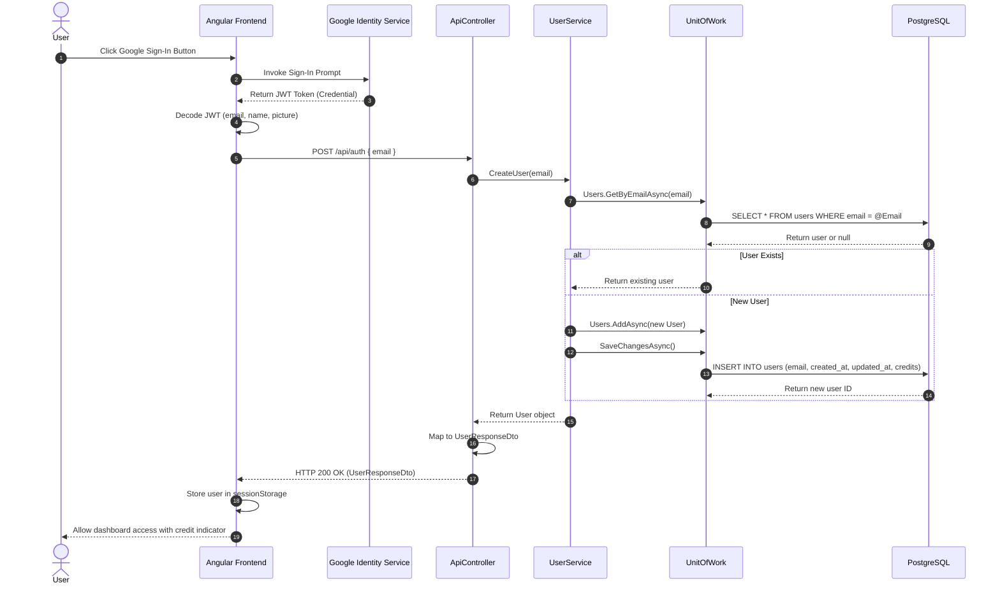

# System Architecture — AI Meme Generator

This document outlines the architecture, data flows, components, and design decisions of the **AI Meme Generator**. It is intended to help developers understand how the system is structured and how its components interact.

---

## High-Level Architecture

The system follows a classic client-server (3-tier) architecture, extended with external third-party cloud services for generative AI and media hosting.



---

## Core Components

### 1. Frontend SPA (Angular 19)
The frontend is built using Angular 19 standalone components, utilizing signals for state management.
- **[DashboardComponent](file:///Users/sumrendersingh/Desktop/meme/fe/src/app/components/dashboard/dashboard.component.ts):** Orchestrates the overall page state, handles the text input submission, and triggers meme generation.
- **[MemeComponent](file:///Users/sumrendersingh/Desktop/meme/fe/src/app/components/meme/meme.component.ts):** Encapsulates the visual presentation of a single meme. It uses the **HTML5 Canvas API** to load template images (with CORS enabled) and dynamically overlays wrapped text with semi-transparent background bars on the client side.
- **[ApiService](file:///Users/sumrendersingh/Desktop/meme/fe/src/app/services/api.service.ts):** Manages backend HTTP calls for meme generation (`/generate-memes`) and random meme retrieval (`/random-memes`).
- **[AuthService](file:///Users/sumrendersingh/Desktop/meme/fe/src/app/services/auth.service.ts):** Initializes Google Identity Services (GIS), handles login callback tokens, decodes JWT user information, and manages session state.

### 2. Backend Web API (ASP.NET Core 8)
A lightweight REST API following a clean Controller-Service pattern:
- **[ApiController](file:///Users/sumrendersingh/Desktop/meme/be/Controllers/ApiController.cs):** Exposes HTTP endpoints for OAuth authentication/user registration and meme generation requests.
- **[MemeService](file:///Users/sumrendersingh/Desktop/meme/be/Services/MemeService.cs):** The orchestrator for meme generation. Retrieves templates via the Unit of Work/repositories (backed by EF Core), formats the Gemini prompt, invokes the LLM, and maps the JSON response back to image URLs. Uses `IMemoryCache` to cache meme templates across requests.
- **[GeminiService](file:///Users/sumrendersingh/Desktop/meme/be/Services/GeminiService.cs):** Low-level HTTP client wrapper that serializes requests and posts prompts to the Google Gemini 1.5 Flash API endpoint.
- **[ImageService](file:///Users/sumrendersingh/Desktop/meme/be/Services/ImageService.cs):** Provides utility methods for SkiaSharp-based server-side canvas painting and Cloudinary image uploading (used for backend batch asset management).
- **[UserService](file:///Users/sumrendersingh/Desktop/meme/be/Services/UserService.cs):** Manages user registration, profile retrieval, and remaining credit balances via the Unit of Work/repositories.
- **[AppDbContext](file:///Users/sumrendersingh/Desktop/meme/be/Data/AppDbContext.cs):** EF Core DbContext with `DbSet<User>` and `DbSet<MemeTemplate>`. Configures entities via Fluent API (`IEntityTypeConfiguration<T>`).
- **[Repositories](file:///Users/sumrendersingh/Desktop/meme/be/Data/Repositories/):** Generic `IRepository<T>` / `Repository<T>` pattern with specialized `IUserRepository` (adds `GetByEmailAsync`) and `IMemeTemplateRepository`.
- **[Unit of Work](file:///Users/sumrendersingh/Desktop/meme/be/Data/UnitOfWork/):** `IUnitOfWork` / `UnitOfWork` wrapping the DbContext, exposing repositories and `SaveChangesAsync()` for transactional commits.
- **[Seed Data](file:///Users/sumrendersingh/Desktop/meme/be/Data/Seed/MemeTemplateSeedData.cs):** Static seed records for 11 meme templates, consumed by `HasData()` in `MemeTemplateConfiguration` and baked into EF Core migrations.
- **[Configurations](file:///Users/sumrendersingh/Desktop/meme/be/Data/Configurations/):** Fluent API entity configurations for `User` (snake_case column mapping, defaults) and `MemeTemplate` (snake_case mapping, seed data).

---

## Detailed Data Flows

### 1. Meme Generation Sequence
This flow details how user input text is turned into multiple meme options.



### 2. User Authentication and Sign-In Flow


---

## Database Design

The schema is built on **PostgreSQL 15** and uses basic indexing for lookup optimization.

### 1. `users` Table
Stores registered users, their creation timestamp, and remaining execution credits.

| Column | Type | Constraints | Description |
|--------|------|-------------|-------------|
| `id` | `SERIAL` | `PRIMARY KEY` | Auto-incrementing identifier |
| `email` | `VARCHAR(255)` | `UNIQUE`, `NOT NULL` | The verified email from Google OAuth |
| `created_at` | `TIMESTAMP WITH TIME ZONE` | `NOT NULL` | Timestamp when the user registered |
| `updated_at` | `TIMESTAMP WITH TIME ZONE` | `NOT NULL` | Timestamp of the last profile update |
| `credits` | `INTEGER` | `NOT NULL`, `DEFAULT 5` | Available API credits for generating memes |

### 2. `meme_templates` Table
Stores available meme base images along with semantic details to feed into the AI prompt.

| Column | Type | Constraints | Description |
|--------|------|-------------|-------------|
| `id` | `SERIAL` | `PRIMARY KEY` | Auto-incrementing identifier |
| `name` | `VARCHAR(255)` | `UNIQUE`, `NOT NULL` | Identifier matching key in prompt JSON |
| `url` | `VARCHAR(512)` | `NOT NULL` | Secure Cloudinary CDN asset URL |
| `description` | `TEXT` | `NOT NULL` | Contextual meaning & facial cues of the meme |
| `example` | `TEXT` | `NOT NULL` | A reference caption illustrating usage |

---

## Key Design Decisions

1. **Client-Side vs Server-Side Text Overlay:**
   - *Decision:* The application implements client-side text overlay using HTML5 Canvas in the [MemeComponent](file:///Users/sumrendersingh/Desktop/meme/fe/src/app/components/meme/meme.component.ts) for general UI presentation, but retains server-side image processing capability using SkiaSharp in [ImageService](file:///Users/sumrendersingh/Desktop/meme/be/Services/ImageService.cs).
   - *Rationale:* Client-side rendering saves bandwidth, avoids saving millions of customized user images on Cloudinary, and allows instant client-side file downloads. The server-side SkiaSharp wrapper is preserved for potential future batch jobs or API-only consumption.
2. **Entity Framework Core with Repository + Unit of Work:**
   - *Decision:* EF Core 8 is used with code-first migrations, Fluent API configurations, Repository pattern, and Unit of Work for transaction management.
   - *Rationale:* Provides compile-time safety, automatic migration management, seed data via `HasData()`, and clean separation of data access concerns. The Repository+UoW pattern allows services to remain decoupled from the ORM.
3. **IMemoryCache for Template Caching:**
   - *Decision:* Meme templates are cached using `IMemoryCache` with a 1-hour expiration.
   - *Rationale:* Templates rarely change, so cross-request caching eliminates redundant database queries while the short TTL ensures eventual consistency if templates are added or modified.
4. **Structured Prompt Output:**
   - *Decision:* The prompt strictly demands structured JSON output from Gemini and explicitly asks to exclude code block decorators (e.g. ` ```json `).
   - *Rationale:* Allows reliable parsing into a dictionary object inside [MemeService](file:///Users/sumrendersingh/Desktop/meme/be/Services/MemeService.cs) while minimizing LLM parsing failures.
