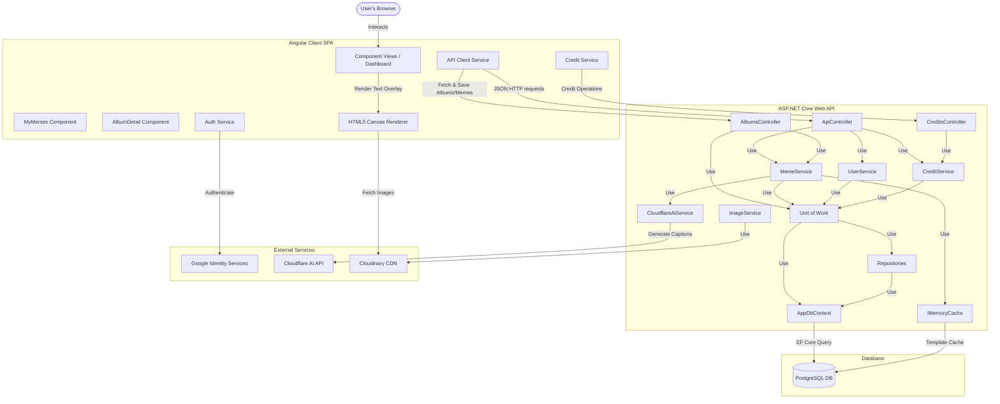
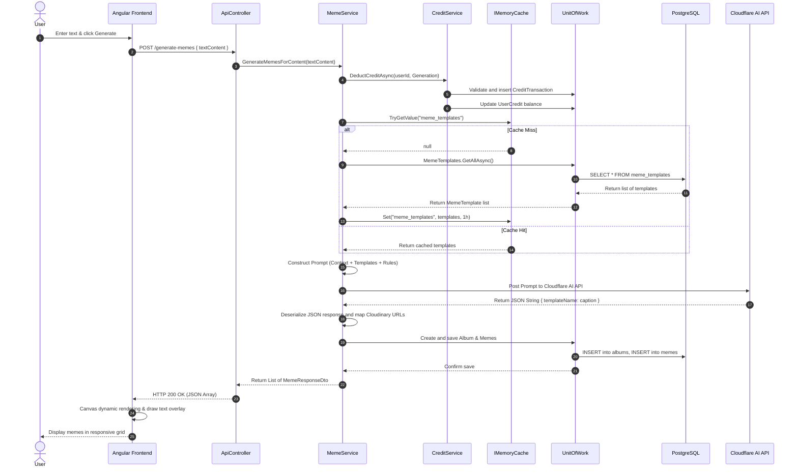

# System Architecture — AI Meme Generator

This document outlines the architecture, data flows, components, and design decisions of the **AI Meme Generator**. It is intended to help developers understand how the system is structured and how its components interact.

---

## High-Level Architecture

The system follows a classic client-server (3-tier) architecture, extended with external third-party cloud services for generative AI and media hosting.



---

## Core Components

### 1. Frontend SPA (Angular 19)
The frontend is built using Angular 19 standalone components, utilizing signals for state management.
- **[DashboardComponent](file:///fe/src/app/components/dashboard/dashboard.component.ts):** Orchestrates the overall page state, handles the text input submission, and triggers meme generation.
- **[MemeComponent](file:///fe/src/app/components/meme/meme.component.ts):** Encapsulates the visual presentation of a single meme. It uses the **HTML5 Canvas API** to load template images and dynamically overlays wrapped text.
- **[MyMemesComponent](file:///fe/src/app/components/my-memes/my-memes.component.ts):** Lists the user's previously generated meme albums, enabling easy navigation and history tracking.
- **[AlbumDetailComponent](file:///fe/src/app/components/album-detail/album-detail.component.ts):** Displays the full detail of a specific meme album, listing all generated memes for a particular prompt.
- **[ApiService](file:///fe/src/app/services/api.service.ts):** Manages backend HTTP calls for meme generation (`/generate-memes`), random meme retrieval, and album/meme loading.
- **[AuthService](file:///fe/src/app/services/auth.service.ts):** Initializes Google Identity Services (GIS), handles login callbacks, and manages JWT session state.
- **[CreditService](file:///fe/src/app/services/credit.service.ts):** Handles fetching and tracking credits on the client side.

### 2. Backend Web API (ASP.NET Core 8)
A lightweight REST API following a clean Controller-Service pattern:
- **[ApiController](file:///be/Controllers/ApiController.cs):** Exposes HTTP endpoints for OAuth authentication/user registration and meme generation.
- **[AlbumsController](file:///be/Controllers/AlbumsController.cs):** Manages user album creation, retrieval, and detailed viewing of saved memes.
- **[CreditsController](file:///be/Controllers/CreditsController.cs):** Exposes endpoints to retrieve the current user's credit balance.
- **[MemeService](file:///be/Services/MemeService.cs):** The orchestrator for meme generation. Retrieves templates, constructs Cloudflare AI prompts, and handles the creation/saving of generated memes in the database.
- **[CreditService](file:///be/Services/CreditService.cs):** Centralizes all credit deduction, validation, and transaction tracking logic.
- **[CloudflareAiService](file:///be/Services/CloudflareAiService.cs):** Low-level HTTP client wrapper that communicates with the Cloudflare AI REST API to execute LLM queries (e.g. Llama models).
- **[UserService](file:///be/Services/UserService.cs):** Manages user registration and profile retrieval.
- **[AppDbContext](file:///be/Data/AppDbContext.cs):** EF Core DbContext containing sets for `User`, `MemeTemplate`, `Album`, `Meme`, `UserCredit`, and `CreditTransaction`.
- **[Repositories](file:///be/Data/Repositories/):** Repositories encapsulating data access, including `IAlbumRepository`, `IMemeRepository`, `ICreditRepository`, and `ICreditTransactionRepository`.
- **[Unit of Work](file:///be/Data/UnitOfWork/):** Orchestrates transaction boundaries across all repositories.

---

## Detailed Data Flows

### 1. Meme Generation Sequence
This flow details how user input text is turned into multiple meme options and stored in an album.



---

## Database Design

The schema is built on **PostgreSQL 15** and uses basic indexing for lookup optimization.

### 1. `users` Table
Stores registered users and their creation/update timestamps.

| Column | Type | Constraints | Description |
|--------|------|-------------|-------------|
| `id` | `SERIAL` | `PRIMARY KEY` | Auto-incrementing identifier |
| `email` | `VARCHAR(255)` | `UNIQUE`, `NOT NULL` | The verified email from Google OAuth |
| `created_at` | `TIMESTAMP WITH TIME ZONE` | `NOT NULL` | Timestamp when the user registered |
| `updated_at` | `TIMESTAMP WITH TIME ZONE` | `NOT NULL` | Timestamp of the last profile update |

### 2. `meme_templates` Table
Stores available meme base images along with semantic details to feed into the AI prompt.

| Column | Type | Constraints | Description |
|--------|------|-------------|-------------|
| `id` | `SERIAL` | `PRIMARY KEY` | Auto-incrementing identifier |
| `name` | `VARCHAR(255)` | `UNIQUE`, `NOT NULL` | Identifier matching key in prompt JSON |
| `url` | `VARCHAR(512)` | `NOT NULL` | Secure Cloudinary CDN asset URL |
| `description` | `TEXT` | `NOT NULL` | Contextual meaning & facial cues of the meme |
| `example` | `TEXT` | `NOT NULL` | A reference caption illustrating usage |

### 3. `albums` Table
Stores collections of generated memes associated with a single text prompt.

| Column | Type | Constraints | Description |
|--------|------|-------------|-------------|
| `id` | `SERIAL` | `PRIMARY KEY` | Auto-incrementing identifier |
| `text_content` | `TEXT` | `NOT NULL` | The original input text prompt |
| `created_at` | `TIMESTAMP WITH TIME ZONE` | `NOT NULL` | Creation timestamp |
| `updated_at` | `TIMESTAMP WITH TIME ZONE` | `NOT NULL` | Last update timestamp |
| `user_id` | `INTEGER` | `FOREIGN KEY` | Reference to the owning `user` |

### 4. `memes` Table
Stores individual meme records including the selected template and generated caption.

| Column | Type | Constraints | Description |
|--------|------|-------------|-------------|
| `id` | `SERIAL` | `PRIMARY KEY` | Auto-incrementing identifier |
| `caption` | `TEXT` | `NOT NULL` | Generated caption overlay |
| `meme_template` | `VARCHAR(512)` | `NOT NULL` | Template image key or URL |
| `created_at` | `TIMESTAMP WITH TIME ZONE` | `NOT NULL` | Creation timestamp |
| `album_id` | `INTEGER` | `FOREIGN KEY` | Reference to the parent `album` |

### 5. `user_credits` Table
Stores current credit balances for users by credit type.

| Column | Type | Constraints | Description |
|--------|------|-------------|-------------|
| `id` | `SERIAL` | `PRIMARY KEY` | Auto-incrementing identifier |
| `user_id` | `INTEGER` | `FOREIGN KEY` | Reference to the owning `user` |
| `credit_type` | `INTEGER` | `NOT NULL` | Enum type representing credit type (e.g. Free/Paid) |
| `amount` | `INTEGER` | `NOT NULL` | Current credit balance |
| `updated_at` | `TIMESTAMP WITH TIME ZONE` | `NOT NULL` | Last update timestamp |

### 6. `credit_transactions` Table
Ledger recording all credit credit additions and deductions.

| Column | Type | Constraints | Description |
|--------|------|-------------|-------------|
| `id` | `SERIAL` | `PRIMARY KEY` | Auto-incrementing identifier |
| `user_id` | `INTEGER` | `FOREIGN KEY` | Reference to the `user` |
| `credit_type` | `INTEGER` | `NOT NULL` | Credit type used |
| `transaction_type` | `INTEGER` | `NOT NULL` | Enum type (e.g. Generation / Add) |
| `amount` | `INTEGER` | `NOT NULL` | Amount of credits changed (negative for deduction) |
| `reference_type` | `VARCHAR(100)` | `NULL` | Contextual reference model type |
| `reference_id` | `INTEGER` | `NULL` | ID of the associated reference model |
| `created_at` | `TIMESTAMP WITH TIME ZONE` | `NOT NULL` | Creation timestamp |

---

## Key Design Decisions

1. **Client-Side vs Server-Side Text Overlay:**
   - *Decision:* The application implements client-side text overlay using HTML5 Canvas in the `MemeComponent` for general UI presentation, but retains server-side image processing capability using SkiaSharp in `ImageService`.
   - *Rationale:* Client-side rendering saves bandwidth, avoids saving millions of customized user images on Cloudinary, and allows instant client-side file downloads. The server-side SkiaSharp wrapper is preserved for potential future batch jobs or API-only consumption.
2. **Entity Framework Core with Repository + Unit of Work:**
   - *Decision:* EF Core 8 is used with code-first migrations, Fluent API configurations, Repository pattern, and Unit of Work for transaction management.
   - *Rationale:* Provides compile-time safety, automatic migration management, seed data via `HasData()`, and clean separation of data access concerns. The Repository+UoW pattern allows services to remain decoupled from the ORM.
3. **IMemoryCache for Template Caching:**
   - *Decision:* Meme templates are cached using `IMemoryCache` with a 1-hour expiration.
   - *Rationale:* Templates rarely change, so cross-request caching eliminates redundant database queries while the short TTL ensures eventual consistency if templates are added or modified.
4. **Structured Prompt Output:**
   - *Decision:* The prompt strictly demands structured JSON output from the AI and explicitly asks to exclude code block decorators (e.g. ` ```json `).
   - *Rationale:* Allows reliable parsing into a dictionary object inside `MemeService` while minimizing LLM parsing failures.
5. **Separation of Credits Tracking and Transaction Ledger:**
   - *Decision:* Credits are stored in a dedicated `user_credits` table and tracked via a ledger in `credit_transactions`.
   - *Rationale:* This decouples credit balances from core user profiles, allows support for multiple credit types, and creates an audit trail for all changes.
